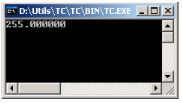
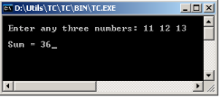

# LAB1

### **Bài 1** Làm quen với CodeBlocks
- Mở chương trình CodeBlocks và tạo 1 Project mới
- Mở file `main.c` 
- Gõ lại nội dung chương trình như sau
```
#include <stdio.h>

void main()
{
	int principal, period;
	float rate, si;

	principal = 1000;
	period = 3;
	rate = 8.5;

	si = principal * period * rate / 100;

	printf(“%f”, si);
}
```
- Lưu chương trình lại
- Biên dịch và thực thi chương trình

**Kết quả chương trình**



### **Bài 2** Đọc số nhập từ bàn phím
- Tạo 1 Project mới từ CodeBlocks
- Mở file `main.c`
- Gõ lại nội dung chương trình như sau:
```
#include <stdio.h>

void main()
{
int a, b, c, sum;

printf("\nEnter any three numbers: ");
scanf("%d %d %d", &a, &b, &c);

sum = a + b + c;

printf("\n Sum = %d", sum);	
}
```

- Lưu chương trình lại
- Biên dịch và thực thi chương trình

**Kết quả chương trình**



### **Bài 3**
Nhập vào 3 số nguyên dương. Kiểm tra xem 3 số đó có phải là 3 cạnh của 1 tam giác hay không. In kết quả ra màn hình.

### **Bài 4**
Nhập vào bán kính đường tròn R. Tính chu vi và diện tích hình tròn rồi in kết quả ra màn hình.

### **Bài 5**
Viết chương trình nhập vào 1 số, sau đó tính bình phương của số đó rồi in ra màn hình.

### **Bài 6**
Viết chương trình đổi đơn vị m sang inch. 
Người dùng nhập vào 1 số, sau đó in ra màn hình giá trị inch tương ứng của số đó.
*Công thức* `1 met = 39.3701 inch`

### **Bài 7**
Viết chương trình giải phương tình bậc 1: `ax + b = c`. 
Người dùng nhập vào 3 số a,b,c. Tính giá trị x rồi in kết quả ra màn hình.